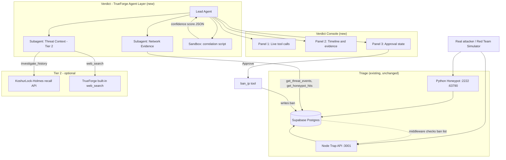
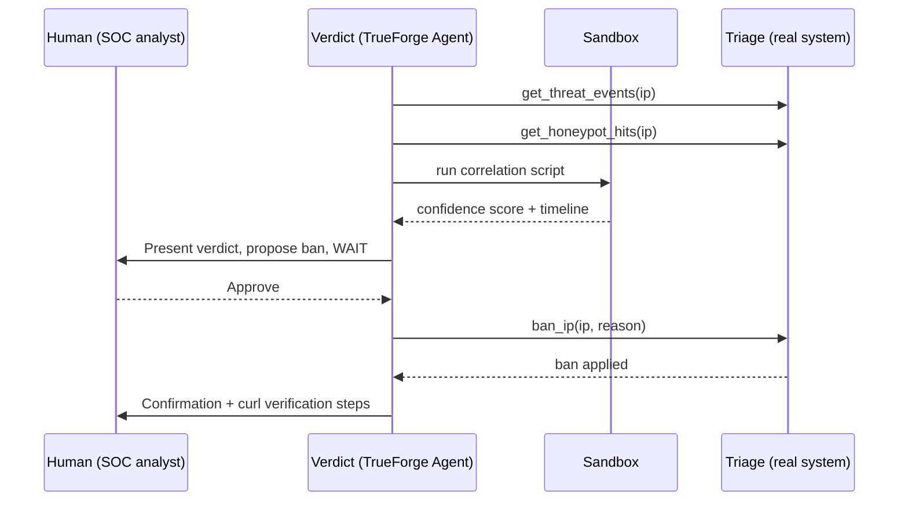

# Verdict. An agent that investigates a suspected attacker using real evidence from Triage, correlates it in a sandbox, and only acts after a human approves the verdict.

## Why this exists

[Triage](https://github.com/CodeWithMehru/Triage) is an existing OTel-powered SOC dashboard that automatically bans IP addresses based on honeypot hits. However, automated, black-box bans without human oversight or full context can be dangerous. 

For this hackathon, we built **Verdict** — a real TrueForge agent layer that takes over that critical decision process. Instead of an immediate auto-ban, Verdict investigates the IP like a real analyst would. It pulls live evidence from Triage's databases (and optionally cross-references threat intel graphs using [KoshurLock-Holmes](https://github.com/CodeWithMehru/KoshurLock-Holmes)), computes a structured timeline in a secure sandbox, and proposes a formal action. 

Crucially, Verdict **pauses** execution at a mandatory human-in-the-loop checkpoint, ensuring that an irreversible action (like banning an IP) only occurs after a human judge reviews the evidence and explicitly clicks "Approve."

## Architecture



## Sequence Flow



## Capabilities: Tier 1 vs Tier 2

- **Tier 1 (Guaranteed Core Features)**
  - `get_threat_events`: Pulls live trap API hits directly from the Triage database.
  - `get_honeypot_hits`: Extracts live port-scanning attempts from the Triage honeypot logs.
  - `run_sandbox_script`: Executes a deterministic Python correlation script (`agent/sandbox-scripts/correlate.py`) inside a secure TrueForge sandbox to combine events, compute a confidence score, and build a chronological timeline.
  - Mandatory Approval Checkpoint: Safety mechanism requiring human confirmation before calling `ban_ip`.

- **Tier 2 (Stretch & Advanced AI Context)**
  - `investigate_history`: An MCP wrapper querying KoshurLock-Holmes to cross-reference IP history against external threat intel knowledge graphs.
  - `web_search`: Uses TrueForge's built-in web search tool to gather public reputation data on the target IP.
  - `flag_leak`: An advanced tool allowing the agent to flag suspected secret exposures (requires human approval).
  - Parallel Subagents: A coordinator agent orchestrates specialized subagents (`network-evidence` and `threat-context`) to execute these tools concurrently.

## Tech Stack

| Component | Technology | Version (from package.json) |
|-----------|------------|-----------------------------|
| Agent Harness | TrueForge | v0.1.4 |
| Tool Interface | Model Context Protocol (MCP) Server | `@modelcontextprotocol/sdk ^1.12.0` |
| Database Client | Supabase JS | `@supabase/supabase-js ^2.49.0` |
| Console UI | Next.js (App Router) | `next 16.2.11` |
| UI Framework | React & Tailwind CSS | `react 19.2.4`, `tailwindcss ^4` |
| Sandboxing | TrueForge Sandbox | Daytona Code Mode |

## Setup & Run Instructions

Assuming a clean machine, run these steps in order to start the entire stack locally:

### 1. Start Triage (Existing Core)
```bash
cd Triage/api
npm install
npm run dev

# In a separate terminal:
cd Triage/dashboard
npm install
npm run dev
```

### 2. Start KoshurLock-Holmes (Optional Tier 2)
```bash
cd KoshurLock-Holmes
docker compose up -d
```

### 3. Start Verdict Agent Server & TrueForge Harness
```bash
# Install agent MCP server dependencies
cd agent/mcp-server
npm install
npm run build

# Start the TrueForge Agent layer (ensure Docker is running for sandboxes)
cd ../..
npx @truefoundry/trueforge
```

*The Verdict Console UI runs on `http://localhost:3000/verdict-console` (via the Triage Dashboard server).*

### 4. Sandbox Testing (Optional)
The correlation script merges evidence and generates a transparent score (Labels: 0–39 = low, 40–69 = medium, 70–100 = high). You can test it locally outside the agent:
```bash
cd agent/sandbox-scripts
# Run built-in test fixtures
python3 correlate.py --test
# Or pipe custom JSON
echo '{"ip":"10.0.0.1","threat_events":[...],"honeypot_hits":[]}' | python3 correlate.py
```

## Demo


<!-- ffmpeg -i demo-recording.mov -vf "fps=12,scale=800:-1:flags=lanczos" -loop 0 docs/demo.gif -->

[Watch the full 3-Minute Demo Video](https://youtube.com/YOUR_DEMO_LINK_HERE)

## Why TrueForge is doing real work here

This is not a thin wrapper or a fake typing animation. TrueForge is doing heavy lifting throughout the pipeline:
1. **Real MCP Tool Calls**: The agent communicates with live, stateful external databases (Supabase).
2. **Real Sandbox Execution**: The correlation logic runs securely in a Daytona-backed sandbox (using `config.sandbox.enabled: true`), guaranteeing the model doesn't hallucinate the confidence score. The sandbox is provisioned on-demand, executing generated code safely.
3. **Mandatory Human Control**: The system leverages TrueForge's strict `require_approval_for_tools` config to forcibly halt the LLM execution until a human clicks "Approve" via the SDK. 
4. **Genuine Parallel Subagents**: (Tier 2) The lead agent dynamically provisions separate agent instances to handle distinct investigation tracks concurrently.

## Qodo Code Review Evidence

- **PR**: [Insert Link to Hackathon Feature PR]
- **What Qodo found**: [Qodo observation placeholder]
- **What we did**: [Fix or mitigation placeholder]
- **Follow-up review**: [Insert Link to PR Comment showing the fix]

## Judging Criteria Mapping

| Criteria | How Verdict Hits It |
|----------|---------------------|
| **Impact** | Transforms blind, automated IP blocking into an auditable, intelligent, and context-aware SOC workflow. |
| **Creativity** | Subagent orchestration cleanly separates deterministic network evidence from generative threat context analysis. |
| **Technical Excellence** | Uses real MCP tool execution against live databases, secure sandbox evaluation, and SSE streaming for UI logs. |
| **Use of Sponsor Tools** | Fully leverages TrueForge agent specifications, built-in approval checkpoints, sandboxing (Daytona), and the SDK for real-time console streaming. |
| **Control & Safety** | Zero unapproved actions. The irreversible `ban_ip` tool is hardcoded behind a mandatory approval gate in both the manifest and system prompt. |
| **Presentation** | Clean, dark-mode engineering console that provides a judge with immediate context within 10 seconds of opening the page. |

## License

MIT License

Copyright (c) 2026 KoshurLock Holmes contributors

Permission is hereby granted, free of charge, to any person obtaining a copy of this software and associated documentation files (the "Software"), to deal in the Software without restriction, including without limitation the rights to use, copy, modify, merge, publish, distribute, sublicense, and/or sell copies of the Software, and to permit persons to whom the Software is furnished to do so, subject to the following conditions:

The above copyright notice and this permission notice shall be included in all copies or substantial portions of the Software.

THE SOFTWARE IS PROVIDED "AS IS", WITHOUT WARRANTY OF ANY KIND, EXPRESS OR IMPLIED, INCLUDING BUT NOT LIMITED TO THE WARRANTIES OF MERCHANTABILITY, FITNESS FOR A PARTICULAR PURPOSE AND NONINFRINGEMENT. IN NO EVENT SHALL THE AUTHORS OR COPYRIGHT HOLDERS BE LIABLE FOR ANY CLAIM, DAMAGES OR OTHER LIABILITY, WHETHER IN AN ACTION OF CONTRACT, TORT OR OTHERWISE, ARISING FROM, OUT OF OR IN CONNECTION WITH THE SOFTWARE OR THE USE OR OTHER DEALINGS IN THE SOFTWARE.

## Team

- **Mehru** - Full Stack & Agent Engineer

## Running the Verdict Console UI

The Verdict Console (three-panel live agent UI) runs as a dedicated route inside Triage's
existing Next.js dashboard — kept as its own separate page, Triage's own screens were not
modified. Source is included in `verdict-console/` for review.

To run it:
1. Start Triage's dashboard: `cd Triage/dashboard && npm run dev`
2. Open `http://localhost:3000/verdict-console`
