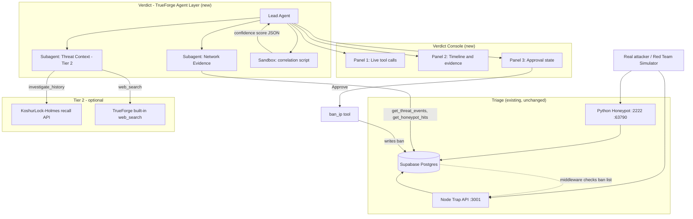
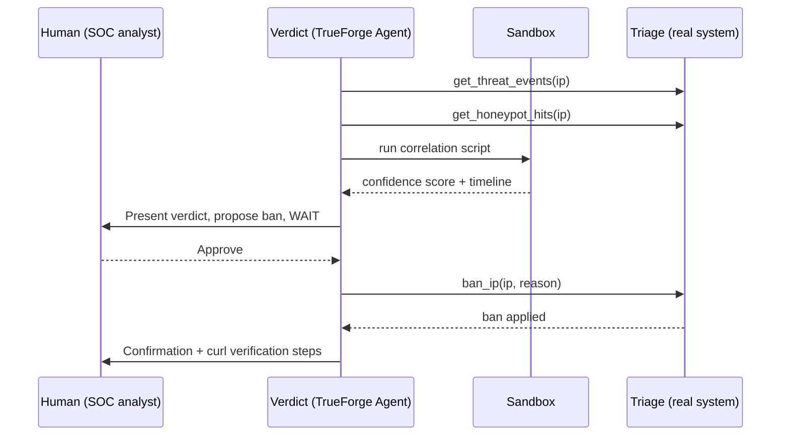

# Verdict. An agent that investigates a suspected attacker using real evidence from Triage, correlates it in a sandbox, and only acts after a human approves the verdict.

## Why this exists

[Triage](https://github.com/CodeWithMehru/Triage) is an existing OTel-powered SOC dashboard that automatically bans IP addresses based on honeypot hits. However, automated, black-box bans without human oversight or full context can be dangerous.

For this hackathon, we built **Verdict** — a real TrueForge agent layer that takes over that critical decision process. Instead of an immediate auto-ban, Verdict investigates the IP like a real analyst would. It pulls live evidence from Triage's Supabase databases, computes a structured timeline and confidence score in a secure sandbox, and proposes a formal action.

Crucially, Verdict **pauses** execution at a mandatory human-in-the-loop checkpoint, ensuring that an irreversible action (like banning an IP) only occurs after a human judge reviews the evidence and explicitly clicks "Approve."

## Architecture



## Sequence Flow



## Capabilities

These are the tools actually implemented and running in this submission:

- **`get_threat_events(ip)`** — Queries Triage's Supabase database for trap API hits (SQLi, XSS, data leaks, etc.) for a given IP. Returns up to 50 most recent events.
- **`get_honeypot_hits(ip)`** — Queries Triage's Supabase database for honeypot port-scan events for a given IP. Returns up to 100 most recent hits.
- **`ban_ip(ip, reason)`** — Inserts an `AUTO_BAN` row into Triage's database. Triage middleware immediately begins returning 403 for that IP. **Requires explicit human approval** via TrueForge's checkpoint — the harness will not let this run automatically.
- **`flag_leak(ip, pattern)`** — Inserts a `LEAK_FLAG` row for a detected secret/key leak. Also requires human approval.
- **Sandbox execution** — The agent runs `sandbox-scripts/correlate.py` inside TrueForge's Daytona sandbox at runtime to compute a deterministic confidence score (0–100) and chronological timeline. The model does not compute this score itself.
- **Mandatory approval checkpoint** — Configured via `require_approval_for_tools: ["ban_ip", "flag_leak"]` in the agent spec. Cannot be bypassed by prompt manipulation.

### Future work (not implemented in this submission)

`investigate_history` (KoshurLock-Holmes knowledge graph recall) and `web_search` are referenced in the system prompt as graceful-fallback Tier 2 tools. The MCP server code for `investigate_history` exists but requires a running KoshurLock-Holmes instance (a separate external service, not part of this repo). `web_search` is a TrueForge built-in skill declared in the agent spec. Neither is a hard dependency — the agent degrades gracefully if they are unavailable.

## Tech Stack

| Component | Technology | Version |
|-----------|------------|---------|
| Agent Harness | TrueForge | v0.1.4 |
| Tool Interface | MCP Server (Node.js) | `@modelcontextprotocol/sdk ^1.12.0` |
| Database Client | Supabase JS | `@supabase/supabase-js ^2.49.0` |
| Console UI | Next.js (App Router) | `next 16.2.11` |
| UI Framework | React & Tailwind CSS | `react 19.2.4`, `tailwindcss ^4` |
| Correlation Script | Python 3 | `sandbox-scripts/correlate.py` |
| Sandboxing | TrueForge Sandbox | Daytona Code Mode |

## Setup & Run Instructions

Assuming a clean machine with Node.js 20+, Docker, and Python 3 installed.

### 1. Clone and set up environment variables

```bash
git clone https://github.com/CodeWithMehru/verdict
cd verdict
git clone https://github.com/CodeWithMehru/Triage.git
```

Copy the example env file for the MCP server and fill in your real Supabase credentials:

```bash
cp mcp-server/.env.example mcp-server/.env
# Edit mcp-server/.env and set:
#   SUPABASE_URL=...
#   SUPABASE_SERVICE_ROLE_KEY=...
```

Add your Groq API key to `Triage/api/.env`:

```bash
# Append to Triage/api/.env:
GROQ_API_KEY=gsk_your_real_key_here
```

### 2. Start the Triage backend (Terminal 1)

```bash
cd Triage/api
npm install
npm run dev
# → sentinel-trap-api listening on http://localhost:3001
```

### 3. Start the Verdict Console UI (Terminal 2)

```bash
cd Triage/dashboard
npm install
npm run dev
# → Next.js listening on http://localhost:3000
# → Verdict Console at http://localhost:3000/verdict-console
```

### 4. Build the MCP tool server (Terminal 3)

```bash
cd mcp-server
npm install
npm run build
```

### 5. Start the MCP tool server (Terminal 3, continued)

```bash
npm run start
```

### 6. Start TrueForge with your Groq key (Terminal 3, continued)

```bash
cd ..
export GROQ_API_KEY="gsk_your_real_key_here"
npx @truefoundry/trueforge
# → Agent server listening on http://localhost:8790
```

Load the agent spec via the TrueForge UI at `http://localhost:8790`, using the config in `instructions/verdict-agent-spec.json`.

### 7. Test the sandbox script standalone (optional)

```bash
cd sandbox-scripts
# Run built-in test fixtures (3 scenarios)
python3 correlate.py --test

# Or pipe custom JSON
echo '{"ip":"10.0.0.1","threat_events":[],"honeypot_hits":[]}' | python3 correlate.py
```

### 8. Trigger a test attack (optional)

```bash
curl -X POST http://localhost:3001/api/search \
  -H "Content-Type: application/json" \
  -H "X-Forwarded-For: 203.0.113.1" \
  -H "x-triage-api-key: trg_live_demo" \
  -d '{"q":"1=1 UNION SELECT"}'
```

## Demo


<!-- To generate: ffmpeg -i demo-recording.mov -vf "fps=12,scale=800:-1:flags=lanczos" -loop 0 docs/demo.gif -->

[Watch the full 3-Minute Demo Video](https://youtube.com/YOUR_DEMO_LINK_HERE)

## Why TrueForge is doing real work here

This is not a thin wrapper or a fake typing animation. TrueForge is doing real heavy lifting:

1. **Real MCP tool calls against a live database** — the Tier 1 tools (`get_threat_events`, `get_honeypot_hits`) hit Triage's live Supabase instance directly; zero fixtures or mocks for what's implemented in this submission.
2. **Real sandbox execution** — the correlation logic runs inside a Daytona-backed sandbox provisioned on demand (`config.sandbox.enabled: true`). The model cannot hallucinate the confidence score; it must come from the sandbox stdout.
3. **Mandatory human approval** — `require_approval_for_tools: ["ban_ip", "flag_leak"]` is enforced at the harness level. The LLM execution is forcibly halted until a human clicks Approve in the Verdict Console. This cannot be bypassed by prompting.

## Qodo Code Review Evidence

- **PR**: [Insert link to hackathon feature PR]
- **What Qodo found**: [Real Qodo finding]
- **What we did**: [Fix or dismissal with reasoning]
- **Follow-up review**: [Link to post-fix review]

## Judging Criteria Mapping

| Criteria | How Verdict Hits It |
|----------|---------------------|
| **Impact** | Transforms blind, automated IP blocking into an auditable, human-approved SOC workflow with a full evidence trail. |
| **Creativity** | Treats every agent action as a real forensic investigation step — evidence gathering, sandbox scoring, structured verdict — before any irreversible action. |
| **Technical Excellence** | Real MCP tool execution against a live database, sandbox-computed confidence scoring, SSE streaming for live UI logs. |
| **Use of Sponsor Tools** | Fully leverages TrueForge agent spec, built-in approval checkpoints, sandbox (Daytona Code Mode), and SSE streaming. |
| **Control & Safety** | Zero unapproved destructive actions. `ban_ip` and `flag_leak` are gated at the harness level, not just in the system prompt. |
| **Presentation** | Clean, dark-mode engineering console — three always-visible panels, judge understands the workflow within 10 seconds. |

## Qodo Code Review Evidence

- **PR**: https://github.com/CodeWithMehru/Verdict/pull/1
- **What Qodo found**: 4 correctness/maintainability issues — incorrect `agent/` path prefixes
  throughout setup instructions, a missing Triage clone step, the MCP server being built but
  never started, and a README claim that overstated which tools use Supabase.
- **What we did**: Fixed all 4 in a follow-up commit on the same PR — corrected all paths, added
  the clone step, added the `npm run start` step, and narrowed the Supabase claim to only the
  implemented Tier 1 tools.
- **Follow-up review**: Same PR — Qodo re-reviewed the second commit and marked all 4 findings
  "Resolved" with 0 remaining bugs.
  
## License

MIT — see [LICENSE](LICENSE) for the full text.

## Team

- **Mehraan Amin** — Full Stack & Agent Engineer
